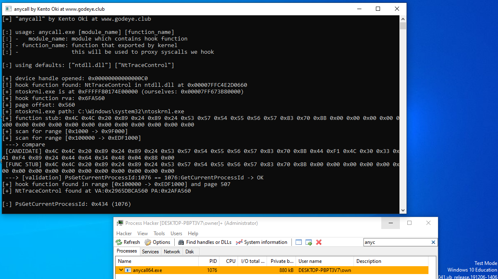
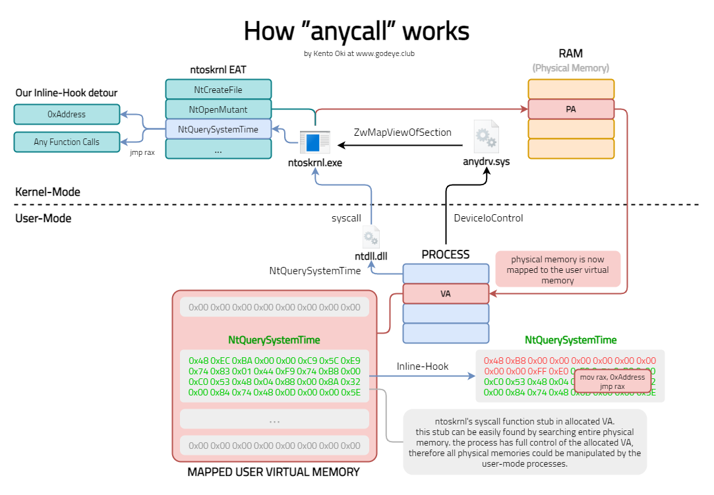

# anycall
x64 Windows kernel code execution in user-mode, arbitrary syscall, vulnerable IOCTLs demonstration

## How it works

1. Allocate physical memory to user virtual memory
	- Allows user-process to manupulate arbitrary physical memory without calling APIs
2. Search entire physical memory until we found function stub to hook, in `ntoskrnl.exe` physical memory
3. Once the stub found, place inline-hook on the stub
	- simply `jmp rax`, detour address could be anything we want to invoke
4. `syscall` it
5. wow, we are `user-mode` but able to call kernel APIs

## Goal of this project

This project is to demonstrate how drivers that allowing user-process to map physical memory for user, and how it is critical vulnerable.

## License

MIT